# 基于大数据技术的房价分析系统的设计与实现

> 公开脱敏版：保留论文正文与技术插图；学校模板、页眉页脚、校徽、身份元数据不进入公开文件，含个人资料或凭据的截图已隐藏。

目 录

## 绪论

### 选题背景

当前，北京作为中国的首都和国家中心城市，其房地产市场一直备受广泛关注。随着城市化进程的加速和居民生活水平的提高，购房成为许多家庭的一项重要决策。然而，北京的房价波动巨大，市场信息复杂多变，给购房者带来了巨大的决策压力。在这一背景下，对北京房价进行深入研究并利用机器学习技术进行分析具有重要的现实意义。

首先，北京房价的高低直接关系到居民的居住成本和生活质量。深入了解北京房价的动态变化和市场特征，有助于政府更好地引导楼市发展，制定合理的调控政策，以维护市场的稳定和居民的切实利益。

其次，通过机器学习技术对大量的二手房数据进行分析，可以挖掘出市场中的潜在规律和趋势。这不仅对购房者提供了全面的市场认知，有助于他们做出明智的购房决策，同时也为开发商、投资者等市场参与者提供了有力的市场洞察，提高了市场的效率和透明度。

此外，通过可视化分析和聚类算法，可以更好地呈现数据的内在结构，使得复杂的信息更易于理解。这种对数据的深入挖掘，有助于揭示不同地区、不同类型房源之间的差异，为购房者提供更加具体、个性化的购房建议。

综上所述，本研究旨在通过机器学习技术，以北京房价为切入点，深入分析市场特征，为政府、购房者及其他市场参与者提供全面的市场信息，以推动北京房地产市场的健康发展，提升居民的居住体验，促进城市的可持续发展。

### 国内外发展现状

随着信息技术和大数据技术的迅速发展，房地产市场的数据分析系统在国内外得到了广泛应用。在国外，房地产数据分析起步较早，相关技术较为成熟。以美国为代表，诸如Zillow、Redfin等房地产信息平台通过整合房产交易、房屋特征、地理位置、学区、交通、经济指标等多维度数据，运用机器学习和数据可视化技术，为用户提供精确的价格估值、市场趋势预测及个性化推荐服务。这些平台不仅服务于购房者和租房者，也成为政府决策和研究机构进行房地产市场调控和研究的重要数据来源。

相比之下，国内的房地产数据分析系统起步较晚，但发展速度非常迅速。近年来，伴随“智慧城市”建设和“数字中国”战略的推进，越来越多的企业和政府机构开始重视对房价数据的采集与分析。贝壳找房、链家、安居客等平台通过移动互联网和人工智能技术，逐步建立起了较为完善的房价数据库系统，能够提供较为详尽的房产信息查询和趋势分析服务。然而，在数据开放程度、模型算法透明度、空间数据精度等方面仍存在一定差距。

### 研究内容

本研究的主要目标是通过机器学习技术深入分析北京房地产市场，为购房者提供全面的市场认知和决策支持。具体而言，主要包括以下几个方面的研究内容：

网络爬虫数据采集与清洗： 运用Python中的Requests和Beautifulsoup库，搭建网络爬虫系统，从链家网上收集所有北京二手房的房源数据。随后，对采集到的数据进行清洗，确保数据的准确性和可用性。

数据分析与可视化： 运用Python中的Numpy、Matplotlib和Pandas等数据分析工具，对清洗后的数据进行深入分析。通过可视化手段，揭示大量数据中隐藏的规律和趋势，为后续研究提供基础。

聚类分析与房源分类： 引入k-means聚类算法，对所有二手房数据进行聚类分析。通过聚类的结果，将二手房源大致分类，以形成对所有数据的概括总结。这一步骤有助于深入理解不同房源之间的相似性和差异性。

地理信息展示与高德地图集成： 结合高德地图开发者应用JS API，将聚类分析的结果以地理信息的形式展示。这使得购房者可以直观地了解不同区域的房源分布情况，为地理位置因素对房价的影响提供更清晰的认知。

综合分析与决策支持： 结合以上各个步骤的研究结果，综合分析北京房地产市场的基本特征、规律和趋势。通过机器学习技术的支持，为购房者提供更全面、深入的市场认知，为他们的购房决策提供科学、合理的支持。

通过这些主要研究内容，本研究旨在为购房者、政府和市场参与者提供一种全新的视角，帮助他们更好地理解和参与北京房地产市场，提高市场的透明度和决策的科学性。

### 章节内容安排

## 第一章为概述章节，主要介绍本系统的选题背景与国内外发展现状；

## 第二章为关键技术介绍章节，主要介绍Python开发语言，网络爬虫技术，数据分析技术；

## 第三章为系统需求分析章节，通过用例图的形式展现本系统所需要实现的功能；

## 第四章为系统设计章节，对系统的关键功能：数据采集，数据分析，聚类分析等进行业务逻辑，业务流程设计；

## 第五章为实现章节，阐述本系统如何使用Python开发语言，HTML，Numpy等技术实现数据采集，数据分析，机器学习等功能；

## 第六章为系统测试章节，主要采用黑盒测试方法对系统的数据分析，数据采集功能进行测试，保证系统的稳定性。

## 关键技术介绍

### 网络爬虫技术

网络爬虫技术是通过模拟浏览器行为，使用Requests库向链家网发送HTTP请求，获取北京二手房的房源数据。Beautifulsoup库被应用于解析HTML页面，从中提取所需信息，构建了一个高效而灵活的数据采集系统。

#### Requests

Requests 是一个强大而简洁的HTTP库，用于发送HTTP请求。在本系统中，Requests 用于模拟浏览器向链家网发送请求，获取北京二手房的房源数据。其简单易用的接口和丰富的功能使得数据的获取过程更为高效。

#### Beautifulsoup

Beautifulsoup 是一个用于从HTML或XML中提取数据的库，它能够将网页解析成树形结构，方便开发者提取所需信息。在本系统中，Beautifulsoup 用于解析链家网上的HTML页面，从中提取出二手房源数据，为后续的数据处理奠定基础。

### 数据分析

数据分析技术基于Python的核心库，包括Numpy、Matplotlib和Pandas。Numpy提供了高性能的数组对象，支持对房源数据的快速处理。Matplotlib用于绘制直观的数据可视化图表，而Pandas则负责清洗、整理和结构化数据，为后续分析提供有序数据集。

#### Numpy

Numpy 是Python中用于科学计算的核心库，提供了高性能的多维数组对象。在本系统中，Numpy 用于处理和操作二手房源数据，例如数据的清洗和转换。其强大的数学运算功能使得数据处理更为便捷。

#### Matplotlib

Matplotlib 是Python中用于绘制图表和数据可视化的库。在本系统中，Matplotlib 用于可视化分析，将清洗后的数据以图表形式展示，帮助研究者更好地理解数据的分布和趋势。

#### Pandas

Pandas 是Python中用于数据分析的重要库，提供了灵活的数据结构和数据分析工具。在本系统中，Pandas 用于清洗、整理和处理采集到的房源数据，为后续的聚类分析和可视化提供整齐有序的数据结构。

#### K-means聚类算法

k-means 是一种常用的聚类分析算法，它将数据集分为 k 个簇，使得同一簇内的数据点相似度较高。在本系统中，k-means 被应用于对所有二手房数据的聚类分析，通过将房源划分为不同的簇，研究者可以更好地理解房源之间的相似性和差异性。

k-means聚类算法是一种强大的数据分析工具，被应用于对所有二手房数据的聚类分析。通过将房源划分为不同簇，揭示了房源之间的相似性和差异性，为系统提供了更深入的市场洞察。

### Web系统技术

#### HTML

HTML（Hypertext Markup Language）是一种用于创建和设计网页的标记语言。它由一系列标签组成，每个标签都有特定的含义和功能，用于定义文档结构、内容和样式。HTML作为网页的基础语言，负责描述文档的结构，并通过标签将各个元素组织起来，使其在浏览器中正确显示。

在本系统中，HTML技术被用于展示通过数据分析获得的图表和可视化结果。通过Matplotlib等库生成的图表可以以HTML形式嵌入网页中，为用户提供直观的数据呈现。通过HTML的图像标签（），可以将分析得到的图片插入到网页中，使得用户能够轻松浏览、比较和分析图表，为购房者提供更清晰的市场信息。

通过HTML的灵活性，系统能够生成动态而交互性的报告页面，使得研究者和购房者可以更直观地理解和利用通过数据分析获得的结果。这种结合HTML技术的图表展示方式为系统的可视化分析提供了更广泛的应用和用户交互性。

#### Django

Django 是一个高级的 Python 网络框架，可以快速开发安全和可维护的网站，它是免费和开源的，有活跃繁荣的社区，丰富的文档，以及很多免费和付费的解决方案。Django 可以使你的应用具有以下优点：完备性、通用性、安全性、可扩展性、可维护性和灵活性，通过使用 Django，Python 的程序开发人员可以轻松地完成一个正式网站所需要的大部分内容，并进一步开发出全功能的 Web 服务。

#### Simple UI

Simple UI 是基于 Django 开发的一款简洁而强大的后台管理界面，它提供了丰富的组件和灵活的配置选项，能够快速构建后台管理系统。Simple UI 主要依赖于 Vue.js 和 Element UI 框架，为 Django 后台提供了现代化的、响应式的管理界面。它具有直观的用户界面，支持数据可视化、表格展示、表单处理、权限控制等功能，可以大幅度提升后台管理系统的开发效率。

## 系统分析

### 功能性需求分析

本系统的主要业务流程涵盖数据采集、数据清洗、数据处理、可视化分析、数据聚类分析、分析结果展示以及后台爬取数据管理。

在数据采集阶段，系统采用网络爬虫技术获取北京市二手房市场的相关数据，包括房源信息、价格走势、地理位置、周边配套等，确保数据来源的广泛性和实时性。

数据清洗环节对采集到的数据进行去重、缺失值填补、异常值检测等处理，提升数据的完整性和准确性。随后，数据处理模块对数据进行标准化、特征工程和格式转换，使其符合后续分析和建模的要求。

可视化分析模块通过图表、热力图、趋势曲线等方式直观展示市场数据，使用户能够快速理解市场动态。与此同时，数据聚类分析利用机器学习算法对房源进行分类，例如按照价格区间、地理位置、房屋类型等进行分组，帮助用户筛选符合需求的房源。

图3.1 用例图

本系统根据用户类型可分为前台用户和后台用户两类。前台用户主要通过 Web 页面查看房价分析结果，包括各类折线图、用例图及聚类分析结果等。后台用户则负责系统的数据处理与分析流程，主要包括以下操作：执行爬虫脚本，获取最新的房价数据；执行数据清洗脚本，对爬取的数据进行处理和规范化；执行可视化分析脚本，生成图表和数据分析结果；执行聚类分析脚本，提取房价聚类特征；将处理后的数据存入数据库，并可随时手动修改或更新；将所有分析结果同步展示到前台 Web 页面，供前台用户浏览使用。系统的整体功能结构和用户交互流程如图 3.1 所示的用例图所示。

数据采集用例描述如表3.1所示，首先通过浏览器访问链家官网：http://bj.lianjia.com/ershoufang/，获取所有北京区域代码，并记录在文本文件中，然后编写爬虫代码，对官网地址进行数据访问，通过BeautifulSoup解析HTML内容，将解析后得内容存入csv文件中。

表3.1 数据采集用例描述

<table>
<tr><td>名称</td><td colspan="2">数据采集</td></tr>
<tr><td>概述</td><td colspan="2">试用爬虫程序，访问北京链家官网，获取所有北京二手房价，并存入csv文件中</td></tr>
<tr><td>参与者</td><td colspan="2">后台用户</td></tr>
<tr><td>前置条件</td><td colspan="2">可以访问互联网的PC</td></tr>
<tr><td>基本事件流</td><td>步骤</td><td>活动</td></tr>
<tr><td></td><td>1</td><td>启动爬虫程序</td></tr>
<tr><td></td><td>2</td><td>爬虫程序构建请求头与Cookie对北京链家官网进行访问</td></tr>
<tr><td></td><td>3</td><td>分页获取访问的页面，使用BeautifulSoup解析页面，获取页面中的房价数据</td></tr>
<tr><td></td><td>4</td><td>将房价数据存入csv文件中</td></tr>
<tr><td></td><td>6</td><td>系统循环执行3，4步骤，直到所有数据爬取完成为止</td></tr>
</table>

数据清洗用例描述如表3.2所示，在数据采集用例中，系统收集到所有有关北京二手房价数据，数据清洗用例主要帮助用户对采集的数据进行清洗，过滤掉空值与无用的值。

表3.2 数据清洗用例描述

<table>
<tr><td>名称</td><td colspan="2">数据清洗用例</td></tr>
<tr><td>概述</td><td colspan="2">对采集的数据进行清洗，过滤掉为null，为0的数，并将金额进行格式化，过滤车库，商业办公，别墅等数据</td></tr>
<tr><td>参与者</td><td colspan="2">后台用户</td></tr>
<tr><td>前置条件</td><td colspan="2">数据采集已经完成</td></tr>
<tr><td>基本事件流</td><td>步骤</td><td>活动</td></tr>
<tr><td></td><td>1</td><td>用户执行数据清洗文件</td></tr>
<tr><td></td><td>2</td><td>数据清洗文件读取数据采集生成的csv文件</td></tr>
<tr><td></td><td>3</td><td>将清洗的结果，存入到另外一个csv文件中</td></tr>
</table>

可视化分析用例描述如表3.3所示，用户可以对清洗后的数据进行分析，比如北京二手房房屋朝向分布情况，北京二手房建筑类型占比情况，北京二手房房屋用途占水平柱状图，北京二手房房屋分布热力图等分析，最后系统生成分析结果到指定文件夹中。

表3.3 可视化分析用例描述

<table>
<tr><td>名称</td><td colspan="2">可视化分析</td></tr>
<tr><td>概述</td><td colspan="2">对清洗后的数据进行可视化分析，生成分析结果与HTML文件到指定文件夹中</td></tr>
<tr><td>参与者</td><td colspan="2">后台用户</td></tr>
<tr><td>前置条件</td><td colspan="2">数据采集，数据清洗已完成</td></tr>
<tr><td>基本事件流</td><td>步骤</td><td>活动</td></tr>
<tr><td></td><td>1</td><td>用户执行数据分析文件</td></tr>
<tr><td></td><td>2</td><td>系统读取清洗后的结果，然后生成分析结果（图片）到指定文件夹中</td></tr>
<tr><td></td><td>3</td><td>用户执行热力图分析文件</td></tr>
<tr><td></td><td>4</td><td>系统通过百度地图API与房屋地址，反向解析出房屋经纬度，然后将数据转为JS文件，并生成热力图HTML文件，放入指定文件中</td></tr>
<tr><td></td><td>5</td><td>用户可以通过图片查看分析结果；可以执行HTML文件查看房屋分布热力图</td></tr>
</table>

数据聚类分析，k-Means算法是一种聚类算法，它是一种无监督学习算法，目的是将相似的对象归到同一个蔟中，对爬取的房价进行聚类分析，帮助用户更直观的查看房价走势，如表3.4所示。

表3.4 数据聚类分析

<table>
<tr><td>名称</td><td colspan="2">数据聚类分析</td></tr>
<tr><td>概述</td><td colspan="2">对所有数据进行机器学习，聚类分析</td></tr>
<tr><td>参与者</td><td colspan="2">后台用户</td></tr>
<tr><td>前置条件</td><td colspan="2">已经爬取并清洗好所有数据</td></tr>
<tr><td>基本事件流</td><td>步骤</td><td>活动</td></tr>
<tr><td></td><td>1</td><td>选定k值</td></tr>
<tr><td></td><td>2</td><td>创建k个点作为k个簇的起始质心</td></tr>
<tr><td></td><td>3</td><td>分别计算剩下的元素到k个簇中心的相异度（距离），将这些元素分别划归到相异度最低的簇</td></tr>
<tr><td></td><td>4</td><td>根据聚类结果，重新计算k个簇各自的中心，计算方法是取簇中所有元素各自维度的算术平均值。</td></tr>
<tr><td></td><td>5</td><td>将D中全部元素按照新的中心重新聚类</td></tr>
<tr><td></td><td>6</td><td>重复第5步，直到聚类结果不再变化，输出结果</td></tr>
</table>

分析结果展示用例描述如表3.5所示，用户通过地址，可以在浏览器上查看系统整体分析结果，比如查看数据分析生成的图片结果，热力图，聚类分析生成的图片结果与热力图。

表3.5 分析结果展示

<table>
<tr><td>名称</td><td colspan="2">分析结果展示</td></tr>
<tr><td>概述</td><td colspan="2">使用HTML语言与CSS语言结合分析生成的图片，展示结果。</td></tr>
<tr><td>参与者</td><td colspan="2">前台用户与后台用户</td></tr>
<tr><td>前置条件</td><td colspan="2">可视化分析与数据聚类分析已完成</td></tr>
<tr><td>基本事件流</td><td>步骤</td><td>活动</td></tr>
<tr><td></td><td>1</td><td>用户通过浏览器进入分析结果展示网站</td></tr>
<tr><td></td><td>2</td><td>查看分析结果</td></tr>
</table>

后台数据管理用例描述如表3.6所示，用户登录进入系统后台，后台将可视化展示爬取的数据，用户可以对数据进行查询，增加，修改操作。

表 3.6 后台数据管理

<table>
<tr><td>名称</td><td colspan="2">后台数据管理</td></tr>
<tr><td>概述</td><td colspan="2">通过地址进入后台，登录成功后可以对房屋数据进行增加，删除，查询，修改</td></tr>
<tr><td>参与者</td><td colspan="2">后台用户</td></tr>
<tr><td>前置条件</td><td colspan="2">成功登入后台</td></tr>
<tr><td>基本事件流</td><td>步骤</td><td>活动</td></tr>
<tr><td></td><td>1</td><td>进入后台</td></tr>
<tr><td></td><td>2</td><td>系统检验用户是否登录</td></tr>
<tr><td></td><td>3</td><td>如果用户未登录，系统提示请登录</td></tr>
<tr><td></td><td>4</td><td>用户登录后，进入房屋数据管理界面</td></tr>
<tr><td></td><td>5</td><td>用户可以查看爬取到的所有数据，并对数据进行增加，删除，修改等操作</td></tr>
</table>

前台用户登录与注册用例描述如表3.7所示，前台用户需要注册账号，然后成功登录才可以访问前台系统，查看分析结果，在用户注册过程中系统会对账号进行唯一性校验，密码进行加密签名，校验通过后存入前台用户表中；当前台用户登录时候，如果登录成功，系统生成Session，并跳转到系统首页。

表 3.6 前台用户注册与登录用例描述表

<table>
<tr><td>名称</td><td colspan="2">前台用户注册与登录</td></tr>
<tr><td>概述</td><td colspan="2">输入账号与密码进行注册，注册成功后使用该账号与密码进行登录</td></tr>
<tr><td>参与者</td><td colspan="2">前台用户</td></tr>
<tr><td>前置条件</td><td colspan="2">无</td></tr>
<tr><td>基本事件流</td><td>步骤</td><td>活动</td></tr>
<tr><td></td><td>1</td><td>前台用户进入系统</td></tr>
<tr><td></td><td>2</td><td>系统检验是否有Session，如果没有跳转登录界面</td></tr>
<tr><td></td><td>3</td><td>前台用户点击注册按钮，跳转到注册界面</td></tr>
<tr><td></td><td>4</td><td>输入账号密码进行注册；如果账号存在提示账号存在；不存在则提示注册成功</td></tr>
<tr><td></td><td>5</td><td>系统跳转到登录界面，前台用户输入账号与密码进行登录，如果登录成功提示登录成功，并跳转系统首页</td></tr>
</table>

### 非功能性需求分析

性能需求：

实时性：确保系统能够及时反映最新数据，使用户能够即时获取市场动态。

可靠性和稳定性：

系统可靠性：系统应具备高可靠性，确保在各种环境下稳定运行，防止因系统故障导致数据丢失或错误。

稳定性：系统应保持稳定，能够处理大规模数据分析而不出现崩溃或异常。

安全性：

数据安全：数据存储在安全的环境环境中，并且数据分析完成后，需要有定时清理数据的机制。

可维护性：

代码可读性：系统代码应易于阅读，以便于后续维护和更新。

模块化设计：采用模块化设计，方便对系统进行部分功能的修改和扩展，以确保系统的长期可维护性。

### 可行性分析

技术可行性：本系统采用Python作为主要开发语言，结合网络爬虫技术、数据分析库（Numpy、Matplotlib、Pandas）、以及聚类算法（k-means）等先进技术。这些技术成熟、应用广泛，Python生态系统强大，为系统提供了高效而可靠的开发基础。通过HTML技术，系统还能够以直观、交互的方式呈现分析结果，提高用户体验。技术的成熟和可靠性为系统的顺利开发和稳定运行提供了坚实的基础。

经济可行性：本系统采用开源的Python语言和相关库，降低了开发成本。网络爬虫和数据分析等技术在业界广泛应用，拥有大量相关资源和社区支持，减少了系统开发和维护的经济负担。系统的投资主要集中在研究者的技术培训、服务器维护和数据存储上，相对来说是可控的。考虑到系统的价值和应用潜力，经济可行性较高。

法律可行性：本系统在数据采集阶段采用了链家网上公开的二手房数据，遵循了信息获取的合法途径。系统的开发和使用过程中需遵守相关法规和隐私保护政策，确保用户数据的安全和合法性。由于系统并未涉及侵犯他人权益的行为，符合法律法规的要求。在开发和使用过程中，将严格遵循相关法律规定，保障系统的合法性和用户隐私权。

综上所述，本系统在技术上有着稳健的基础，经济上具备成本可控和投资回报的潜力，法律上符合相关法规和隐私保护政策，因而呈现出全面而有利的可行性，为进一步研究和实施提供了有力的支持。

### 本章小结

本章节主要对系统进行了用例分析，确定了系统的实现功能目标，确定了实现步骤。

## 系统设计

### 架构设计

本系统采用三层架构模式，分别为用户展示层、数据处理层和交互层，各层协同工作，以实现高效的数据采集、处理和展示。

用户展示层负责前端界面交互，由 HTML、CSS 和 JavaScript 组成，用户可通过该层查看分析结果，直观获取北京市二手房市场的各类数据分析信息。

数据处理层基于 Django 框架构建，负责数据的管理和交互，包括提供处理前后端请求、维护数据存储等，以保障系统的稳定运行和高效数据传输；承担核心的数据计算与分析任务，采用 Python 及 Pandas、BeautifulSoup 等技术，实现数据采集、清洗、可视化分析和聚类分析等功能，并将生成的分析结果传输至前端界面进行展示

交互层则充当用户展示层和数据处理层之间的数据传输桥梁，主要通过 HTTP 请求实现数据的交互与传递，确保数据流畅流转，系统整体架构图如图4.1所示。

图4.1 系统架构图

通过上述需求分析，可以得知本系统从功能结构上分为五类：数据采集、数据清洗、可视化分析、聚类分析、分析结果展示、数据管理。系统功能结构图如图4.2所示。

图4.2 系统功能结构图

### 功能设计

#### 数据采集功能设计

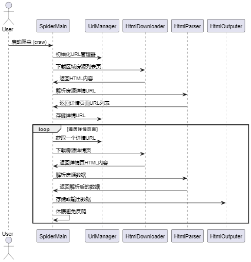

图4.3 数据采集功能时序图

数据采集功能的时序图如图 4.3 所示。本爬虫程序的主要目标是从链家二手房网站（lianjia.com）获取房源数据，并存储以供后续分析。整个数据收集流程采用 URL 管理、下载器、解析器、数据输出 等模块化设计，以确保爬取的稳定性和可扩展性。

首先，程序创建 UrlManager 进行 URL 管理，MyLog 记录日志，HtmlDownloader 负责网页下载，HtmlParser 解析网页数据，HtmlOutputer 处理数据输出。

爬虫遍历预设的区域和分页 URL，依次下载列表页的 HTML 内容，并解析出所有房源详情页面链接，添加至 UrlManager 进行管理。为避免触发反爬机制，程序在适当位置使用 time.sleep 控制请求频率。

随后，爬虫逐个从 UrlManager 获取房源详情页的 URL，进行下载并解析，提取房源信息（如价格、面积、户型等）。解析完成后，数据被存入 HtmlOutputer 进行存储或展示。

#### 数据清洗功能设计

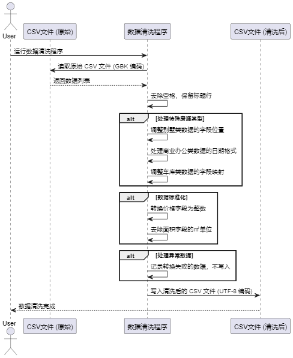

图4.4 数据清洗功能时序图

数据清洗功能时序图如图4.4所示，本程序针对链家二手房数据进行清洗和格式化处理，以确保数据完整、规范，并便于后续分析。首先，读取 GBK 编码的原始 CSV 文件，并去除字段中的多余空格，保留标题行以保持数据结构一致。针对异常数据，调整别墅类数据的字段顺序，使其符合标准格式；检查商业办公类数据的日期字段，不符合 YYYY-MM-DD 格式的列将被删除；修正车库类数据的字段映射，确保数据格式统一。在数据标准化方面，价格字段转换为整数并去除 元 字符，面积字段去除 ㎡ 仅保留数值，同时对 null 和 暂无数据 进行统一处理。最终，清洗后的数据以 UTF-8 编码存储，保证兼容性，并为后续分析提供高质量的数据基础。

#### 可视化分析功能设计

词云可视化分析时序图如图4.5所示，读取 clean.csv 数据文件，并利用 jieba 进行分词，同时剔除常见的无效词，如“null”“暂无”“数据”等，以保证词云的准确性。然后，加载 house2.jpg 作为背景图片，并设定词云的形状。接着，通过 WordCloud 进行词云配置，包括字体、防止乱码、背景颜色、最大词汇数及最大字体大小等参数设置。最终，生成词云并保存为北京二手房数据词云2.png，以直观展示北京二手房市场的高频关键词。

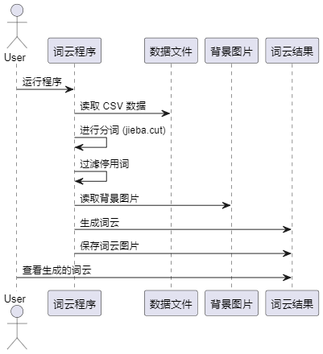

图4.5 词云可视化分析时序图

其他图形分析时序图如图4.6所示，主要用于分析数据并通过图形化展示结果。首先，程序读取数据文件（如 clean.csv），使用自定义列名替代原始列名，以确保数据的可读性，并跳过文件中的首行标题。接着，程序处理缺失值，将指定的标记（如 "null" 和 "暂无数据"）视为缺失值并进行处理。数据运算阶段，针对具体分析目标（如房屋户型占比），统计相应字段的出现次数，选择前若干个最常见类别进行展示，并将其他类别合并为一个统一的分类，以简化数据展示。最后，使用合适的图形工具（如 matplotlib）生成可视化图形，选择适当的颜色映射和图形样式，以提升图像的清晰度和美观度。生成的图像将保存并展示给用户。这一设计确保了数据处理的清晰度，同时采用合理的图形化展示方式提升了数据的可读性和用户体验。

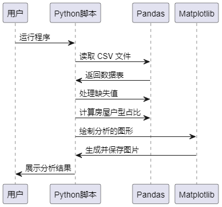

图4.6 图形类分析时序图

热力图时序图如图4.7所示，程序读取存储二手房信息的 CSV 文件，自定义列名并处理缺失值，确保数据的整洁性。接着，使用百度地图 API 获取每个房产的经纬度信息，并将这些信息存储为新的 CSV 文件。然后，程序将经纬度数据与原始房产数据按“id”进行合并，形成一个完整的数据集。最后，程序根据指定条件（如价格低于400万且面积小于80平方米）筛选出特定房产，并将这些数据格式化为 JavaScript 对象，输出到两个不同的文件中。

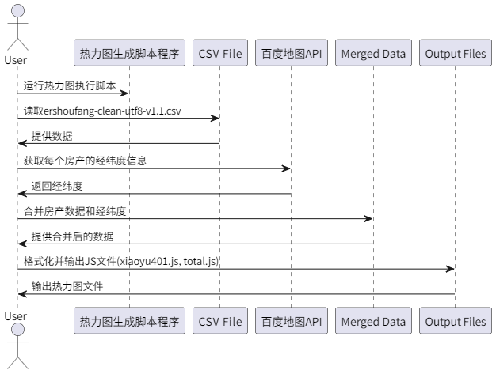

图4.7 热力图生成时序图

#### 聚类分析功能设计

聚类分析时序图如图4.8所示，设计逻辑主要包括数据预处理、选择适当的k值、进行聚类分析以及结果可视化。首先，程序加载并清洗二手房数据，包括处理缺失值、去除离散值等，确保数据的质量和有效性。接着，利用KMeans算法进行聚类分析。KMeans算法的核心是将数据划分为k个簇，其中每个簇由中心点（质心）代表，目标是最小化每个数据点到质心的距离。

在确定k值时，使用了基于SSE（平方误差和）的方法。SSE是衡量数据点与其簇中心的距离平方和，值越小表示聚类效果越好。为了选择最优的k值，程序通过多次计算不同k值下的SSE，并绘制SSE与k值的关系图。根据“肘部法则”（SSE随k值增加而下降，且下降幅度减缓时的k值通常为最优k值），选择合适的k值作为聚类的分组数。该方法能够有效地避免过度聚类或不足聚类，提高聚类结果的稳定性和准确性。

最终，通过聚类结果的可视化，如单价与建筑面积、总价与建筑面积的散点图，进一步展示了聚类的效果，并生成地图数据供后续分析使用。

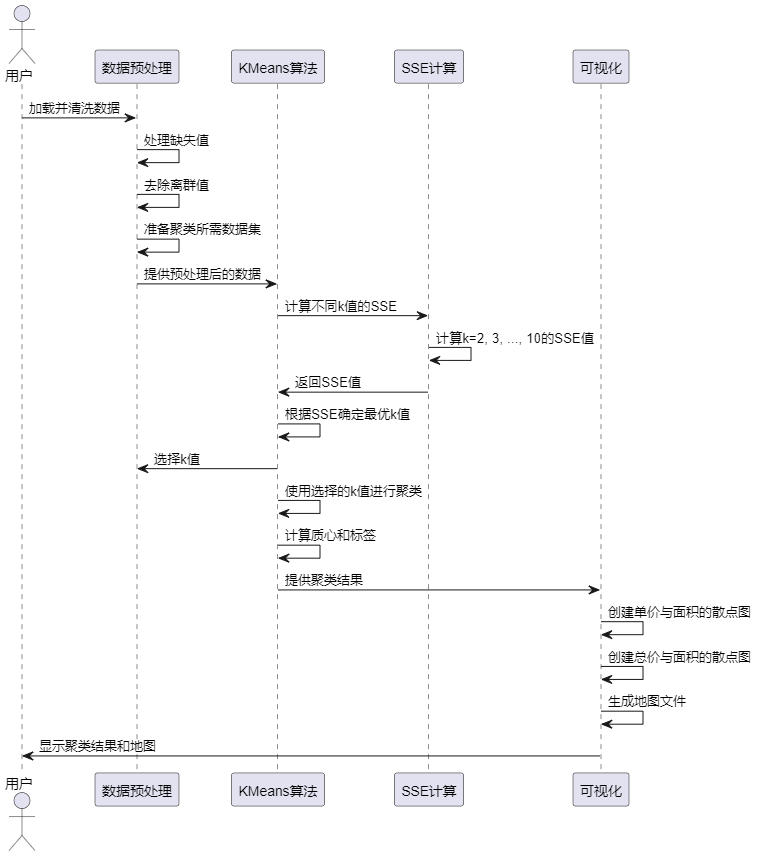

图4.8 聚类分析时序图

### 数据库设计

通过需求分析与功能设计可知，数据采集功能所采集的数据和经过数据清洗后的数据都存储在CSV文件中。因此，本系统使用SQLite数据库作为存储方案。当用户完成所有脚本操作后，系统会将CSV文件中的数据转换为SQLite数据库格式，供Django后台进行使用。

在本系统中，除了房价表（即数据采集和数据清洗后的数据表）外，其他表将由Django根据模型自动生成，Django的ORM（对象关系映射）特性可以根据我们定义的模型类自动创建数据库表，并管理数据之间的关系，以下篇幅有限，这里展示房价表，用户表，Django Admin日志表设计。

房价表如表4.1所示，存储了网络爬虫程序爬取到的链家网房价数据。

表4.1 房价表

<table>
<tr><td>字段名</td><td>数据类型</td><td>主键/允许空</td><td>字段含义</td></tr>
<tr><td>building_area</td><td>varchar(255)</td><td>NULL</td><td>建筑面积</td></tr>
<tr><td>building_structure</td><td>varchar(50)</td><td>NULL</td><td>建筑结构</td></tr>
<tr><td>building_type</td><td>varchar(255)</td><td>NULL</td><td>建筑类型</td></tr>
<tr><td>community_name</td><td>varchar(255)</td><td>NULL</td><td>小区名称</td></tr>
<tr><td>decoration_condition</td><td>varchar(50)</td><td>NULL</td><td>装修情况</td></tr>
<tr><td>district</td><td>varchar(255)</td><td>NULL</td><td>所在区域</td></tr>
<tr><td>elevator_ratio</td><td>varchar(20)</td><td>NULL</td><td>梯户比例</td></tr>
<tr><td>floor_location</td><td>varchar(255)</td><td>NULL</td><td>所在楼层</td></tr>
<tr><td>has_elevator</td><td>varchar(255)</td><td>NULL</td><td>供暖方式</td></tr>
<tr><td>house_certificate_info</td><td>varchar(255)</td><td>NULL</td><td>房本备件</td></tr>
<tr><td>house_layout</td><td>varchar(255)</td><td>NULL</td><td>房屋户型</td></tr>
<tr><td>house_usage</td><td>varchar(255)</td><td>NULL</td><td>房屋用途</td></tr>
<tr><td>house_years</td><td>varchar(255)</td><td>NULL</td><td>房屋年限</td></tr>
<tr><td>id</td><td>int</td><td>PRIMARY KEY</td><td>唯一标识</td></tr>
<tr><td>inner_area</td><td>varchar(255)</td><td>NULL</td><td>套内面积</td></tr>
<tr><td>last_transaction</td><td>varchar(255)</td><td>NULL</td><td>上次交易信息</td></tr>
<tr><td>layout_structure</td><td>varchar(50)</td><td>NULL</td><td>户型结构</td></tr>
<tr><td>listing_time</td><td>varchar(255)</td><td>NULL</td><td>挂牌时间</td></tr>
<tr><td>mortgage_info</td><td>varchar(255)</td><td>NULL</td><td>抵押信息</td></tr>
<tr><td>orientation</td><td>varchar(255)</td><td>NULL</td><td>房屋朝向</td></tr>
<tr><td>property_ownership</td><td>varchar(50)</td><td>NULL</td><td>产权所属</td></tr>
<tr><td>property_rights_years</td><td>varchar(255)</td><td>NULL</td><td>产权年限</td></tr>
<tr><td>total_price</td><td>varchar(255)</td><td>NULL</td><td>总价</td></tr>
<tr><td>transaction_ownership</td><td>varchar(50)</td><td>NULL</td><td>交易权属</td></tr>
<tr><td>unit_price</td><td>varchar(255)</td><td>NULL</td><td>单价</td></tr>
</table>

用户表如表4.2所示，该表是通过Django Admin后台的ORM框架自动生成的，关键字段为is_active，username，password，后台系统的登录将使用这些字段进行鉴权处理。

表4.2 用户表

<table>
<tr><td>字段名</td><td>数据类型</td><td>主键/允许空</td><td>字段含义</td></tr>
<tr><td>date_joined</td><td>datetime(6)</td><td>NOT NULL</td><td>创建时间</td></tr>
<tr><td>email</td><td>varchar(254)</td><td>NOT NULL</td><td>邮箱账号</td></tr>
<tr><td>first_name</td><td>varchar(150)</td><td>NOT NULL</td><td>起始名字</td></tr>
<tr><td>id</td><td>int</td><td>PRIMARY KEY</td><td>主键</td></tr>
<tr><td>is_active</td><td>tinyint(1)</td><td>NOT NULL</td><td>账号是否启用</td></tr>
<tr><td>is_staff</td><td>tinyint(1)</td><td>NOT NULL</td><td>是否普通用户</td></tr>
<tr><td>is_superuser</td><td>tinyint(1)</td><td>NOT NULL</td><td>是否管理员用户</td></tr>
<tr><td>last_login</td><td>datetime(6)</td><td>NULL</td><td>最后登录时间</td></tr>
<tr><td>last_name</td><td>varchar(150)</td><td>NOT NULL</td><td>末尾名字</td></tr>
<tr><td>password</td><td>varchar(128)</td><td>NOT NULL</td><td>登录密码</td></tr>
<tr><td>username</td><td>varchar(150)</td><td>PRIMARY KEY</td><td>登录账号</td></tr>
</table>

Django Admin日志表如表4.3所示，该表同样通过Django Admin后台的ORM框架自动生成，用以记录后台用户操作过程。

表4.2 Django Admin日志表

<table>
<tr><td>字段名</td><td>数据类型</td><td>主键/允许空</td><td>字段含义</td></tr>
<tr><td>action_flag</td><td>smallint unsigned</td><td>NOT NULL</td><td>操作类型</td></tr>
<tr><td>action_time</td><td>datetime(6)</td><td>NOT NULL</td><td>操作时间</td></tr>
<tr><td>change_message</td><td>longtext</td><td>NOT NULL</td><td>内容</td></tr>
<tr><td>content_type_id</td><td>int</td><td>PRIMARY KEY</td><td>操作类型主键</td></tr>
<tr><td>id</td><td>int</td><td>PRIMARY KEY</td><td>主键</td></tr>
<tr><td>object_id</td><td>longtext</td><td>NULL</td><td>操作id</td></tr>
<tr><td>object_repr</td><td>varchar(200)</td><td>NOT NULL</td><td>操作内容描述</td></tr>
<tr><td>user_id</td><td>int</td><td>PRIMARY KEY</td><td>操作用户</td></tr>
</table>

### 本章小结

本章介绍了系统总体架构模式，阐述了数据采集，数据清洗，可视化分析等功能设计逻辑，系统使用Django框架，通过自动生成数据库表简化了数据表管理，提高了开发效率。

## 系统实现

### 数据收集功能实现

爬虫采用模块化实现，主要由五个核心组件构成，分别为UrlManager、HtmlDownloader、HtmlParser、HtmlOutputer以及日志管理模块MyLog。在爬虫主类SpiderMain的构造函数中，以上组件均被依次初始化，为爬虫任务的顺利执行提供基础支撑。

整个爬虫流程由SpiderMain类中的craw()方法启动，逻辑上分为两个主要阶段。第一阶段主要负责抓取所有二手房详情页面的链接。系统通过下载并解析二手房列表页面，提取其中的详情页链接，并调用UrlManager模块将新链接统一管理。第二阶段则遍历UrlManager中存储的详情页链接，依次下载页面内容，并通过HtmlParser解析所需的房源数据，最终由HtmlOutputer输出为结构化的CSV文件。

在具体实现方面，UrlManager模块负责对所有待爬取的URL进行管理，包括新链接的添加（add_new_urls方法）及是否存在未爬取链接的判断（has_new_url方法）。HtmlDownloader则负责页面内容的下载，其中特别加入了随机User-Agent策略，以增加访问行为的多样性，增强爬虫的健壮性和对反爬虫机制的规避能力。

页面解析工作由HtmlParser模块完成。该模块中包含两个核心方法：get_ershoufang_data用于提取二手房详情页面中的关键信息；get_erhoufang_urls用于从列表页中提取所有指向详情页的链接。数据收集完成后，通过HtmlOutputer进行统一管理和输出，其最终结果为结构化的CSV文件，便于后续的数据分析与处理，爬虫结果如图5.1与图5.2所示。

图5.1 爬虫结果

图5.2 爬虫结果2

### 数据清洗功能实现

通过csv.reader读取指定文件: bj.csv中的二手房数据，将每一行数据存储在context列表中。利用列表推导式对每一行的数据项进行处理，使用strip()方法去除每个数据项的空白符和换行符。如果数据的第一个字段是 "id"，直接将该行写入新的文本文件。针对特殊情况，例如存在"别墅"或"商业办公类"的记录，对相关数据项进行对齐或正则表达式匹配，以规范数据。对于 "车库" 的记录，同样进行对齐操作。将整理后的数据写入新的文本文件: clean.csv并进行一些额外的处理：将总价数据项统一整理为整数。去除单价数据项的单位。去除建筑面积和套内面积数据项的单位。在数据项转换失败时，捕获异常并输出相应的提示信息，但仍然继续处理下一条记录，清洗结果如图5.3所示，数据经过清洗后，系统自动排除了不被需要的数据，关键代码如下所示：

if __name__ == "__main__":
 input_filename = "data_file\\bj.csv"
 output_filename = "data_cluster/clean.csv"
 clean_and_write_data(input_filename, output_filename)

图5.3 清洗结果

### 可视化分析功能实现

词云图分析结果如图5.4所示，首先读取北京二手房数据文件（CSV格式）；读取背景图片，作为词云的形状；使用 jieba 进行中文分词，并剔除停用词；将分词结果拼接为字符串。使用 WordCloud 类配置词云的字体、背景颜色、形状等参数；生成词云图，并保存为指定文件，并且在调用WordCloud的generate方法时候，对分词的结果进行统计，显示了频繁出现的词汇，为数据的关键信息提供了直观的可视化呈现，其中五年，抵押，供暖，住宅类型等频繁出现，可以看出现在北京二手房市场的稳定，并且市场趋向于住而不是消费，关键代码如下所示：

ershoufang_words = jieba.cut(comment_text)
ershoufang_words = [word for word in ershoufang_words if word not in stopwords]
cut_text = " ".join(ershoufang_words)
cloud = WordCloud(
 font_path=fontpath,
 background_color='white',
 mask=color_mask,
 max_words=2000,
 max_font_size=60
  )
word_cloud = cloud.generate(cut_text)

图5.4 词云统计分析

二手房用途分析柱状图结果如图5.5所示，通过 pandas 读取并加载了清理后的数据集，然后使用 value_counts 统计了二手房不同用途的数量。接着，利用 matplotlib.pyplot 创建水平柱状图，展示了各种房屋用途的数量分布。最后，通过 savefig 将生成的水平柱状图保存到指定文件夹，通过分析的结果可以得知，北京二手房市场突出于住而不是投资消费，这与词云分析的结果一致。

图5.5 二手房用途柱状图

热力图的实现需要使用到百度地图的API，首先在getlnglat函数使用百度地图API获取每个小区名称对应的经纬度信息。遍历数据集中的小区信息，调用API获得经纬度，将结果保存到latlng.csv文件。读取latlng.csv文件，将经纬度信息与原始数据集进行合并，依据列名id，对合并后的数据进行筛选，选择房价小于400万且建筑面积小于80平方米的二手房数据，将筛选后的经纬度信息以指定格式写入js文件，然后编写好热力图的HTML文件，并引入js文件，根据百度官方文档，实现总价小于400万的二手房热力数据，可以看出北京各个区的小户型刚需房的分布情况，然后在写入所有未筛选的价格，实现总价热力图，结果如图5.6与图5.7所示。

图5.6 小于400万热力图

图5.7 总价热力图

房屋情况分析实现过程：通过 Pandas 库读取名为 "clean.csv" 的 CSV 文件，使用自定义的列名和处理缺失值，使用 Matplotlib 的 plot 函数，指定 kind="pie"，绘制饼图。使用颜色映射 cmap=plt.cm.rainbow 增添可视化效果。利用 autopct 参数显示百分比标签。条形图绘制：使用 Matplotlib 的 plot 函数，指定 kind="bar"，绘制条形图。通过调整图形的大小和添加合适的标题，提高可读性。水平条形图绘制：使用 Matplotlib 的 plot 函数，指定 kind="barh"，绘制水平条形图。通过调整图形的大小和添加合适的标题，提高可读性。使用 Matplotlib 的 savefig 函数，将绘制好的图形保存为图片文件。这些可视化结果展示了北京二手房数据中关于户型、装修、建筑类型、房屋朝向和建筑面积的分布情况，通过分析结果得知2室1厅的精装房屋，在北京二手房市场中最为流行，代表这种类型的房屋受到买房者的热爱，分析结果如图5.8所示。

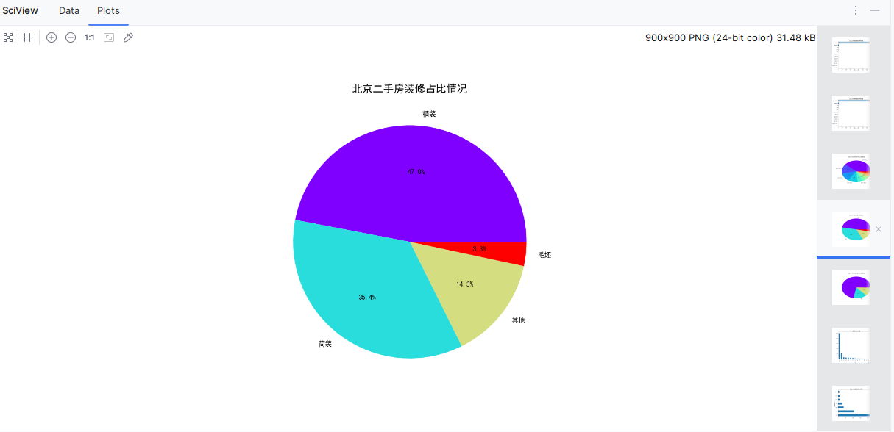

图5.8 房屋情况分析

北京二手房价格分析实现过程：使用 Pandas 库的 read_csv 函数加载名为 clean.csv 的 CSV 文件。通过 skiprows 参数跳过头行，通过 names 参数指定列名，通过 na_values 参数处理缺失值标记为 "null" 和 "暂无数据"，然后进行一系列价格数据的筛选：北京各区域二手房平均单价：将数据按区域分组，计算平均单价，然后绘制柱状图。保存生成的图形为 "北京各区域二手房平均单价.png"。北京各区域二手房单价箱线图：将数据按区域分组，绘制箱线图，展示单价的分布情况。保存生成的图形为 "北京各区域二手房单价箱线图.png"。北京各区域二手房总价箱线图：将数据按区域分组，绘制箱线图，展示总价的分布情况。保存生成的图形为 "北京各区域二手房总价箱线图.png"。北京各区域二手房平均建筑面积：将数据按区域分组，计算平均建筑面积，然后绘制柱状图。保存生成的图形为 "北京各区域二手房平均建筑面积.png"。北京各区域平均单价和平均建筑面积：将数据按区域分组，计算平均单价和平均建筑面积，然后绘制两个子图。保存生成的图形为 "北京各区域平均单价和平均建筑面积.png"。北京各区域二手房房源数量：将数据按区域分组，计算各区域的二手房房源数量，然后绘制折线图。保存生成的图形为 "北京各区域二手房房源数量.png"。北京二手房单价最高Top20：按照单价从高到低排序，选择前20个小区，绘制横向柱状图。保存生成的图形为 "北京二手房单价最高Top20.png"。北京二手房总价与建筑面积散点图：绘制散点图，展示总价与建筑面积的关系。保存生成的图形为 "北京二手房总价与建筑面积散点图.png"。北京二手房单价与建筑面积散点图：绘制散点图，展示单价与建筑面积的关系。保存生成的图形为 "北京二手房单价与建筑面积散点图.png"，结果如图5.9所示，可以通过此结果了解北京二手房市场的价格区间分布，价格与面积，地区之间的联系，帮助购房用户或者市场进行细微调整。

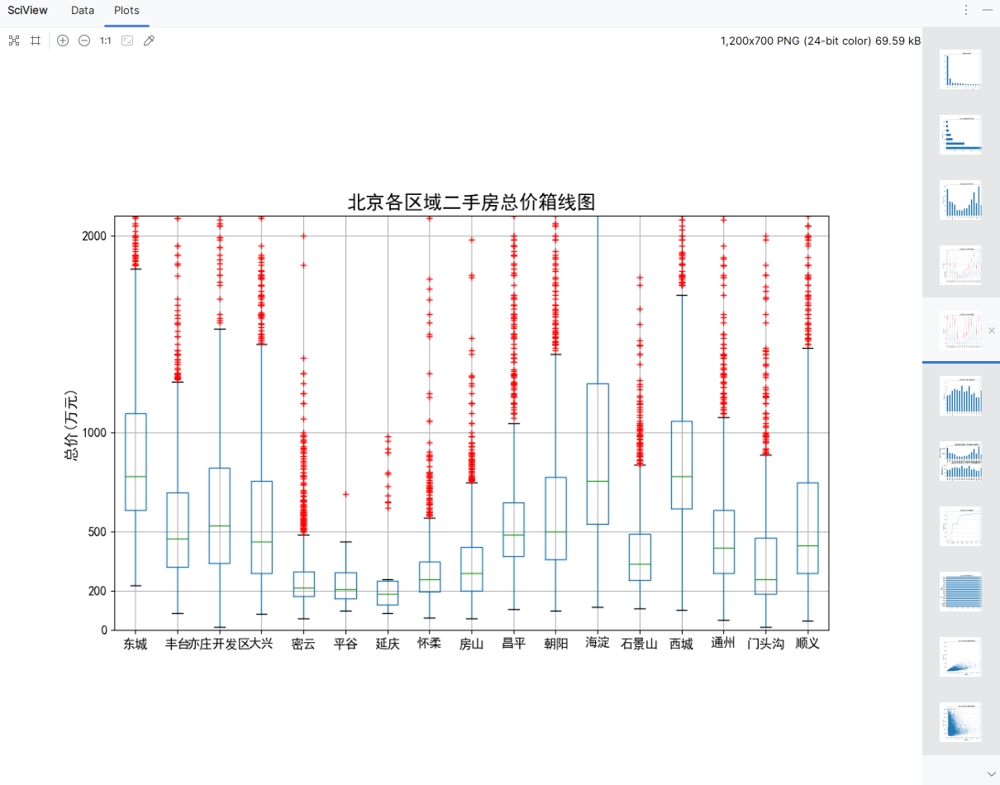

图5.9 房价分析

可视化分析关键代码如下所示，主要使用matplotlib绘制可视化图片，numpy与pandas进行数据读取，筛选，处理，归类等操作。

count_fwhx = df['fwhx'].value_counts()[:10]
df['fwhx'].value_counts()[10:].count()})
count_fwhx = count_fwhx.append(count_other_fwhx)
count_fwhx.index.name = ""
count_fwhx.name = ""
fig = plt.figure(figsize=(9, 9))
ax = fig.add_subplot(111)
ax.set_title("北京二手房房屋户型占比情况", fontsize=18)
count_fwhx.plot(kind="pie", cmap=plt.cm.rainbow, autopct="%3.1f%%", fontsize=12)
plt.savefig("picture\\北京二手房房屋户型占比情况.png")
plt.show()

### 聚类分析功能实现

K值的确定使用了肘部法则。首先，定义了loadDataset()函数加载了两个CSV文件，一个包含房屋数据，另一个包含经纬度信息。数据经过处理后，去除了缺失值和异常值，并只保留了与聚类相关的列：id、total（总价）、unitPriceValue（单价）、jzmj（建筑面积）、lat（纬度）、lng（经度）。处理后的数据最终转换成一个NumPy数组arr_cluster，用于后续的KMeans聚类。然后，通过KMeansClassifier对数据进行KMeans聚类，计算不同k值下的SSE（平方误差和），k值范围从2到10。对于每个k值，KMeans算法会返回聚类结果，包括簇中心、数据点的标签和计算出的SSE值，并记录每个k值的SSE，供后续绘图分析使用。最后，使用matplotlib绘制不同k值下的SSE曲线图，X轴为k值，Y轴为SSE值，通过观察图形中的肘部位置（SSE下降幅度减缓的位置）来选择最佳的k值，如图5.10所示。

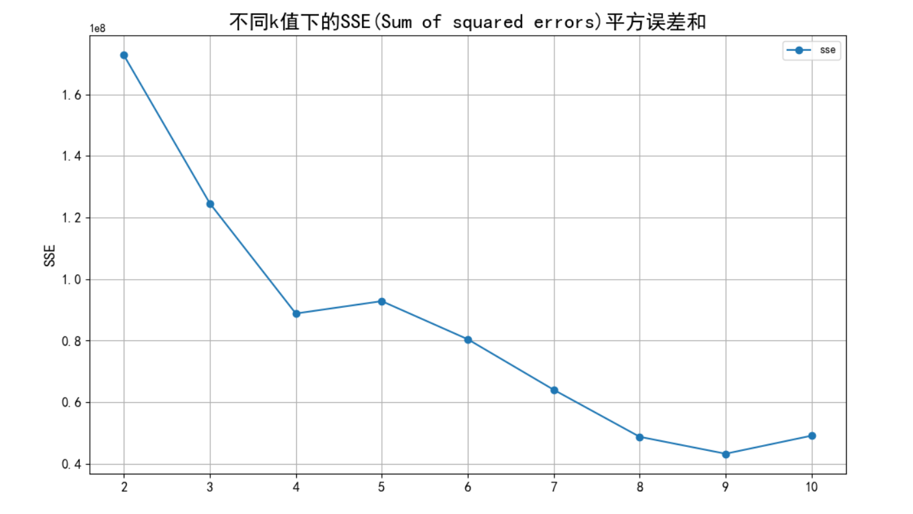

图5.10 K值曲线图

在观察 SSE 曲线时，通常可以发现，当 K 值从 2 增加到 5 时，SSE 显著下降，但在 K=5 之后，下降幅度明显减缓，曲线趋于平稳，形成明显的“肘部”。因此，K=5 被认为是一个较优的选择，它在聚类效果和计算复杂度之间取得了良好的平衡。选择 K=5 是因为继续增加 K 值虽然可以略微降低 SSE，但提升幅度有限，反而可能导致模型过拟合。确定 K 值后，K-Means 聚类算法首先随机初始化 K 个簇中心（质心），然后计算每个样本点到所有质心的欧氏距离，并将其分配给最近的质心。接着，算法根据每个簇内样本点的均值重新计算质心位置，并不断迭代，直到质心位置不再发生显著变化或达到最大迭代次数，从而完成聚类过程，聚类代码如代码5.3所示，结果如图5.11所示，关键代码如下所示：

for i in range(m):

minDist = np.inf

minIndex = -1

for j in range(self._k):

distJI = self._calEDist(self._centroids[j,:], data_X[i,1:4])

if distJI < minDist:

minDist = distJI

minIndex = j

if self._clusterAssment[i, 0] != minIndex or self._clusterAssment[i, 1] > minDist**2:

clusterChanged = True

self._clusterAssment[i,:] = minIndex, minDist**2

for i in range(self._k):

index_all = self._clusterAssment[:,0]

value = np.nonzero(index_all==i)

ptsInClust = data_X[value[0]]

self._centroids[i,:] = np.mean(ptsInClust[:,1:4], axis=0)

self._sse = sum(self._clusterAssment[:,1])

distJI = self._calEDist(self._centroids[j,:], data_X[i,1:4])

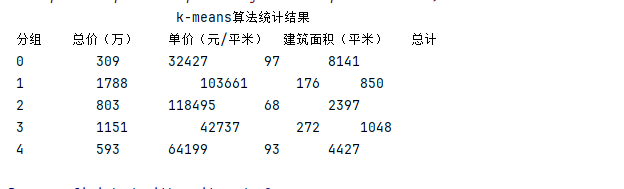

图5.11 聚类结果统计

根据聚类结果可将北京市二手房市场划分为四类典型房源类型，分别体现了不同购房群体的偏好与地理特征：

第3类房源可归为大户型高总价型，其平均建筑面积普遍在200平方米以上。这类房源在整体市场中占比较小，属于较为稀缺资源，主要集中在城市边缘区域，如延庆、通州和昌平等地。

第1类与第2类房源则呈现出核心城区地段优势型的特征。该类房源的单价显著高于平均水平，地理位置优越，交通便利，广泛分布于北京市中心区域，典型代表区域包括海淀、朝阳、东城和西城等。

第4类房源可以被视作大众型小户型蜗居类。其特点为面积较小、总价相对较低且市场供应量充足。此类房源多沿地铁线路分布，适合刚需购房人群，覆盖范围较广，城市各区域均有出现。

第0类房源体现出高性价比特征，通常具备较大的使用面积，但单价较低，因此总价相对适中。此类房源广泛分布于城市外环区域，如大兴、房山、通州及顺义，是预算有限但对居住空间有一定需求购房者的优选。

通过对上述各类房源特征及地理分布的分析，可以更好地理解不同购房群体的市场定位与需求导向，为后续政策制定和市场引导提供数据支持。

### 分析结果展示功能实现

使用HTML语言与上述步骤生成的图片与热力图，将结果整合在一起，用户可以通过此HTML进行分析结果的查询。

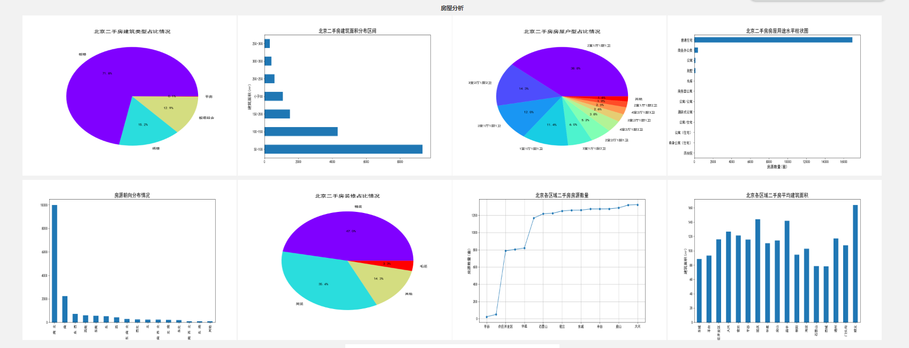

图5.11 房屋分析

房屋分析结果如图 5.11 所示，对北京市二手房相关特征进行统计分析后可得出以下结论：

在房屋朝向方面，数据呈现出显著的长尾分布特征。多数房源集中在少数几种主流朝向，其他朝向类型数量极少，体现出明显的偏态分布。这一现象与日常认知相符，即大部分住宅设计遵循“坐北朝南”的传统理念，强调采光与通风效果。

建筑结构方面，板楼类型占据主导地位，占比高达 65.6%。相比之下，近年来新建住宅中较为常见的塔楼结构在二手房市场中比例较低。这一差异可能与北京市二手房的房龄偏大有关，许多房屋建设时间较早，建筑风格更趋向传统的板式设计。

户型分布方面，两室一厅与两室两厅为主流配置，合计占据近一半的市场份额。同时，三室两厅与三室一厅的比例也不容忽视，表明部分购房者对改善型住房仍有一定需求。相比之下，其余户型的占比较低，呈现出明显的集中趋势。

在装修情况方面，由于所分析的房源均为二手房，接近 60% 的房屋在装修状态一栏中被标注为“其他”，表明这些房源多为业主自行装修，装修风格与质量存在较大差异，缺乏统一标准。

建筑面积方面，分布较为集中在中小户型。50–100 平方米区间的房源数量最多，超过 8000 套。其次为 100–150 平方米与 50 平方米以下两个区间，说明中低总价房源仍是市场主力。

在区域分布方面，东城、大兴、丰台与房山等区域的房源数量显著增加。此现象或可归因于上述区域相对主城区而言房价较为亲民，成为众多“北漂”人群购房或租住的首选地区。

北京市二手房市场在房屋朝向、建筑结构、户型分布、装修状态与面积区间上呈现出结构性集中趋势，而区域分布则体现出价格与地理位置对购房行为的显著影响。

其他结果如图5.12所示，主要就是热力图，通过此图可以看出北京市三环是二手房市场交易主力，也可以侧面分析出大部分群众喜欢在市区三环路附近居住。

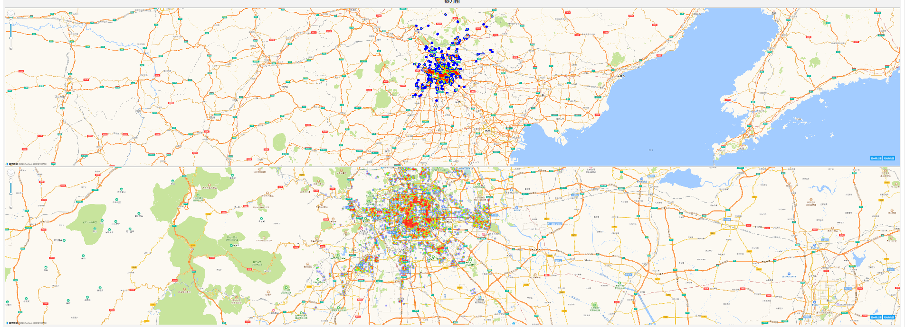

图5.12 其他结果

### 后台数据管理功能实现

后台使用Django框架搭建，然后结合simpleui，搭建后台管理视图，首先创建数据库表house，表中存放的是爬取的北京市二手房价数据，然后在项目中定义好模型models py中定义好数据库的模型，并在admin py文件中，将定义好的数据库模型注册到Django中，并写好list_display与search_fields类，方便后台界面展示该表中的字段与查询参数，然后在控制台输入命令：python manage.py makemigrations与python manage.py migrate，执行Django Admin模块，在输入python manage.py createsuperuser创建初始用户，然后执行项目，并在浏览器中输入127.0.0.1：8080，进行后台登录，然后选择house菜单，即可进行房屋数据的管理，维护系统整体数据的健壮，界面如图5.13所示。

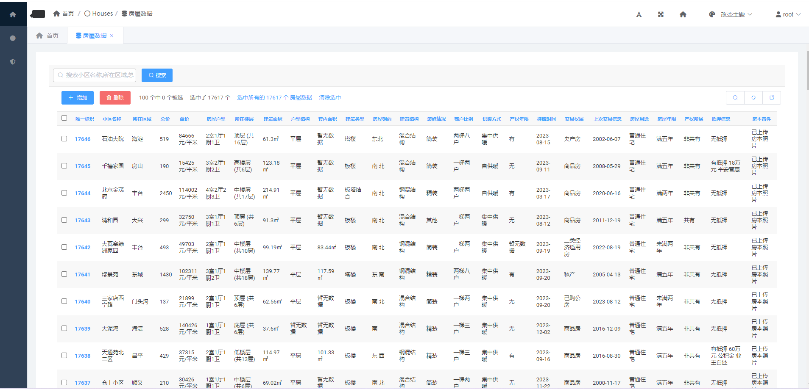

图5.13 后台数据管理

## 系统测试

### 测试环境与方法

系统测试环境为Windows11，Python3.7，集成开发环境(IDE):Pycharm，版本为2024.3.5。

系统测试方法为黑盒测试方法，主要对系统的数据爬取，可视化分析功能进行测试，保证系统流程运行。

### 测试用例

爬虫测试用例中，主要测试系统是否正确绕过链家的反爬机制，是否如设定号的爬虫代码，爬取到了链家网的房价数据，并存入到执行的csv文件中，具体用例如表6.1所示。

表6.1 爬虫测试用例表

<table>
<tr><td>名称</td><td colspan="3">爬虫测试用例表</td></tr>
<tr><td>概述</td><td colspan="3">是否可以正常爬取数据 是否有报错处理机制 是否可以将数据存入CSV文件中 是否为多线程爬取</td></tr>
<tr><td>步骤</td><td>步骤</td><td colspan="2">步骤与预期结果</td></tr>
<tr><td></td><td>1</td><td colspan="2">启动爬虫脚本，爬取链家网北京房价地区数据</td></tr>
<tr><td></td><td>2</td><td colspan="2">通过地区数据，爬取房价数据与房子详细数据</td></tr>
<tr><td></td><td>3</td><td colspan="2">存入CSV文件</td></tr>
<tr><td colspan="4">测试结果</td></tr>
<tr><td>结果</td><td>1a</td><td>成功获取到北京地区数据</td><td>通过</td></tr>
<tr><td></td><td>2a</td><td>成功获取到房价数据与房子详细数据</td><td>通过</td></tr>
<tr><td></td><td>3a</td><td>成功存入了CSV文件</td><td>通过</td></tr>
<tr><td></td><td>4a</td><td>观察计算机CPU值变化，是多线程爬取</td><td>通过</td></tr>
</table>

数据分析测试用例如表6.2所示，主要进行了数据清洗测试，各种分析图生成测试比如词云图等。

表6.2 数据分析

<table>
<tr><td>名称</td><td colspan="3">数据分析测试用例表</td></tr>
<tr><td>概述</td><td colspan="3">测试系统是否可以正常对爬取到的数据进行清洗 测试系统是否可以读取清洗后的文件，分析生成词云图 测试系统是否可以读取清洗后的文件，结合百度地区API，生成热力图 测试系统是否可以读取清洗后的文件，进行饼状图，柱状图等可视化结果生成</td></tr>
<tr><td>步骤</td><td>步骤</td><td colspan="2">步骤与预期结果</td></tr>
<tr><td></td><td>1</td><td colspan="2">执行数据清洗脚本</td></tr>
<tr><td></td><td>2</td><td colspan="2">执行词云图脚本</td></tr>
<tr><td></td><td>3</td><td colspan="2">执行热力图脚本</td></tr>
<tr><td></td><td>4</td><td colspan="2">执行其他分析脚本（房屋情况，房价分析：饼状图，拆箱图等）</td></tr>
<tr><td colspan="4">测试结果</td></tr>
<tr><td>结果</td><td>1a</td><td>清洗成功</td><td>通过</td></tr>
<tr><td></td><td>2a</td><td>词云图生成在指定文件夹中</td><td>通过</td></tr>
<tr><td></td><td>3a</td><td>热力图生成成功，成功通过房屋地名生成经纬度，并自动写入HTML与JS文件中</td><td>通过</td></tr>
<tr><td></td><td>4a</td><td>分析成功，生成了有关房屋与房价的各种分析图形</td><td>通过</td></tr>
</table>

### 本章小结

对于系统进行了黑盒测试，主要覆盖了数据爬取和数据分析等关键功能。在测试过程中，所有被检验的功能，均表现正常，验证了系统的良好运行状态。

## 结论

本系统以链家网为数据源，通过系统化的业务流程包括数据采集、目标数据规划、数据清洗、可视化分析展示以及数据聚类分析，旨在全面分析北京二手房市场数据，为购房者和市场参与者提供有力的决策支持。

首先，在数据采集阶段，通过网络爬虫技术从链家网获取了所有北京二手房的房源数据。明确定义了采集的目标数据，包括房价、面积、地理位置等关键信息，以满足后续分析和用户需求。

其次，在数据清洗过程中，系统对从链家网获取的数据进行了精细处理，包括处理缺失值、异常值和重复值等，以确保数据的准确性和一致性，提高数据质量。

接着，在可视化分析展示阶段，系统运用Python的数据分析库对清洗后的数据进行了多方面的可视化分析，生成折线图、散点图等图表，揭示了数据的分布和趋势，为用户提供了直观的数据呈现。

最后，在数据聚类分析中，系统应用了k-means聚类算法对清洗后的数据进行了深度聚类分析，将二手房数据分成不同的簇。这为深入理解房源之间的相似性和差异性提供了基础，使用户更好地了解市场情况。

最终，通过将数据清洗、可视化分析和聚类分析的结果整合，系统以HTML页面的形式呈现给用户。通过HTML的灵活性，实现了用户友好的交互式展示，使用户能够更加直观地了解北京二手房市场的情况。

综上所述，本系统通过系统化的流程为用户提供了全面、准确、直观的北京二手房市场分析结果，为购房决策提供了有力支持。
